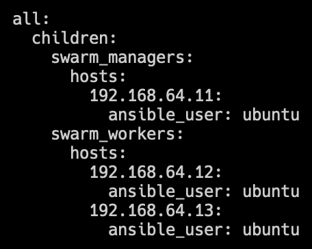
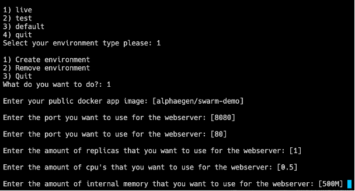

# Disaster Recovery

Binnen dit document beschrijf ik hoe je de IAC Docker Swarm omgeving bij een crash kan herstellen. Er zijn drie niveaus waarop de omgeving kan crashen:

1. De host machines zelf
2. De Docker Swarm Cluster
3. Een applicatie

## De host machines zelf

Op het moment dat de host machines zelf crashen moeten er eerst 2 of meer machines opgezet worden. De machines hiervoor moeten in ieder geval de volgende configuratie hebben:

| Naam                   | Besturingssysteem |
|------------------------|-------------------|
| dockerswarm-manager-1  | Ubuntu 22.04      |
| dockerswarm-worker-x   | Ubuntu 22.04      |

Er kunnen meerdere worker hosts aangemaakt worden. De IP-adressen van alle machines maken niet uit, aangezien we de Docker Swarm in het volgende hoofdstuk zelf opzetten o.b.v. de nieuwe IP-adressen.

Hierna moet SSH-toegang opgezet worden tot alle machines. Hoe je dit doet verschilt per machine waar je op draait, maar je moet de public SSH-key van jouw eigen machine kopiëren en plakken in de `~/.ssh/authorised_keys` file op de remote omgeving.

Als je deze IAC-omgeving op een Macbook lokaal draait en je de crash daar tegenkomt, kun je `make setup-vms` uitvoeren om 3 virtuele machines op te zetten. Hierbij wordt de toegang via SSH ook direct mogelijk gemaakt.

## Docker Swarm Cluster crash

Als de machines met het Ubuntu besturingssysteem eenmaal draaien en je SSH-toegang hebt tot de machines kun je de Docker Swarm opnieuw opzetten. Dit doe je door de juiste IP-adressen in de `inventory.yml` te verwerken en daarna `make setup-cluster` uit te voeren. Zie een voorbeeld van een `inventory.yml` file hieronder:

Dit commando zal automatisch de cluster opzetten op basis van de IP-adressen die je in je `inventory.yml` hebt ingevuld. Als dit commando klaar is zal de Docker Swarm cluster productie klaar zijn.

## Applicatie crash

Binnen de IAC-omgeving kan een klant de volgende omgevingen opzetten:

- Web + database (Live)
- Web (Test)

Hierbij kan een klant een eigen webapplicatie opzetten, waarbij het niet uitmaakt welke techniek wordt gebruikt. Zolang de klant een eigen Docker Image heeft met zowel de applicatie als de webtechniek zelf kan de service gehost worden.

De database data wordt opgeslagen op basis van de klantnaam + omgeving. Zo zal de data van “Herman” in de productieomgeving onder een “herman_live” volume vallen. Deze data wordt automatisch herstelt bij het opstarten van een applicatie op basis van dezelfde omgeving.

De kans dat een applicatie crasht is klein, aangezien er gebruik wordt gemaakt van replicatie, maar het kan voorkomen. Hieronder staan de stappen die de klant moet doorlopen om een volledige omgeving opnieuw op te zetten.

### Selfservice

Om deze omgeving opnieuw op te zetten kan het `./selfservice script uitgevoerd worden. Dit script zal eerst om de klant zijn naam vragen. Deze naam bepaalt de omgeving die opgezet wordt. Bij het herstellen van een applicatie is het dus belangrijk dat dezelfde naam ingevuld wordt als van voor de crash.

### Verwijderen van de oude omgeving (indien nodig)

Hierna kun je kiezen voor het verwijderen van de omgeving. Dit zal nodig zijn op het moment dat een deel van de applicatie is gecrasht, maar niet de service zelf. Denk hierbij aan een crash binnen het Nginx proces zelf in een container, waardoor de container nog steeds online is. Zodra je kiest voor het verwijderen van de omgeving zal hij op basis van de klantnaam + omgeving keuze de juiste omgeving verwijderen.

### Opzetten nieuwe omgeving

Voer het selfservice script weer uit en kies nu voor het opzetten van een nieuwe omgeving. Hieronder een overzicht van de vragen die gesteld worden:

Hierbij kan een klant zelf zijn eisen invullen, waaronder de applicatie Docker Image zelf. De data tussen de haakjes zijn de standaard opties voor de vragen. Wanneer deze stappen zijn doorlopen worden de benodigde services opgestart en de applicatie online gezet. Deze applicatie is nu te bereiken door het IP-adres van één van de machines binnen het cluster in de webbrowser te openen met, als het geen 80 is, de juiste poort. De klant wordt automatisch naar de juiste service geleid.
